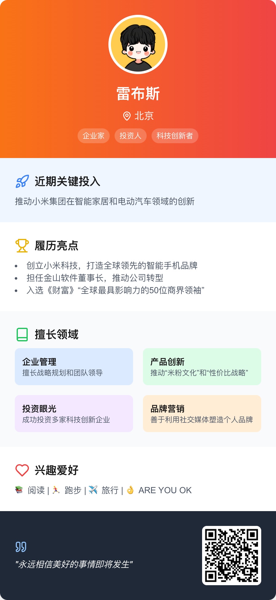

## 这是啥?
- 一个基于zhipuAI的文字到个人卡片的生成工具.

在线体验:https://introcard.iwhy.dev/

灵感来自:[即刻 @一泽Eze] 

原文地址: https://m.okjike.com/originalPosts/66e2a5601bdec5e1e7492e18?s=eyJ1IjoiNTY3YTUwZDQ2ZWY4OWMxMjAwOGE3NTc1IiwiZCI6MX0%3D&utm_source=wechat_session

鸣谢@一泽Eze的提示词

## 如何在此基础上修改,并使用自己的key?
编辑[.env.local](.env.local)文件,填入自己的API_KEY即可.
